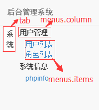

# 数据结构文档

## 系统菜单与权限控制
```
{
    "tab": {
        "label": "系统"
    },
    "menus": {
        "column": {
            "label": "用户管理"
        },
        "items": [{
            "label": "角色管理",
            "route": {
                "0": "admin/index",
                "sort": "-id"
            }
        }]
    },
    "readActions": ["index", "view"],
    "writeActions": ["create", "update", "delete", "multi-delete", "password"]
}
```
