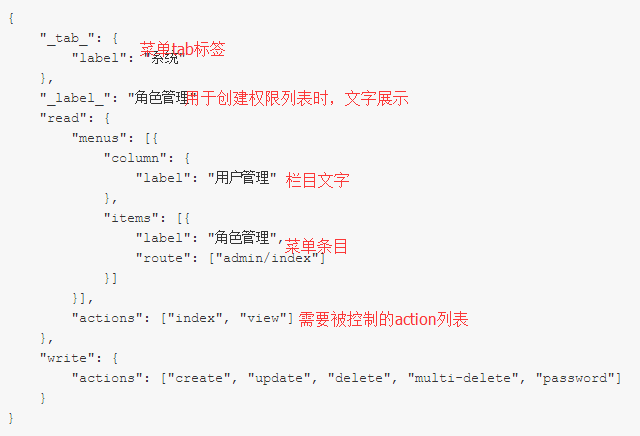

# 数据结构文档

## 系统菜单与权限控制

    {
        "_tab_": {
            "label": "系统"
        },
        "_label_": "角色管理"
        "read": {
            "menus": [{
                "column": {
                    "label": "用户管理"
                },
                "items": [{
                    "label": "角色管理",
                    "route": ["admin/index"]
                }]
            }],
            "actions": ["index", "view"]
        },
        "write": {
            "actions": ["create", "update", "delete", "multi-delete", "password"]
        }
    }

